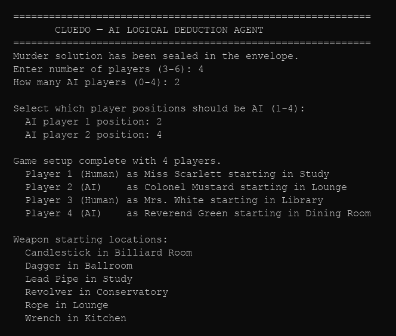
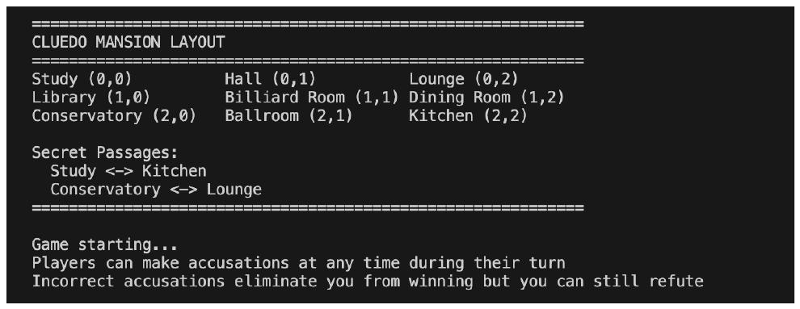
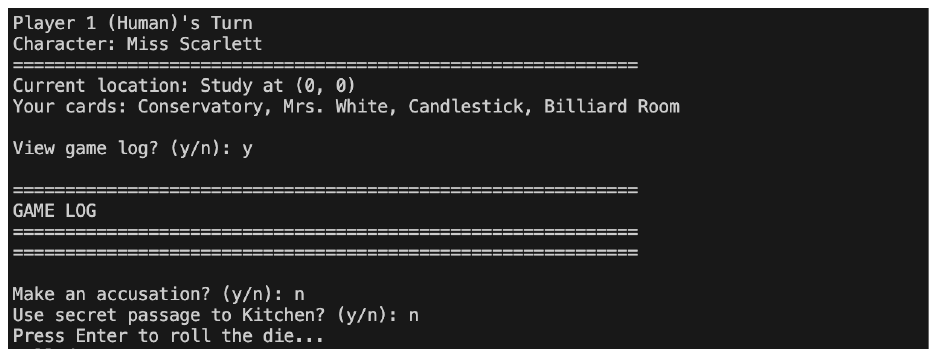
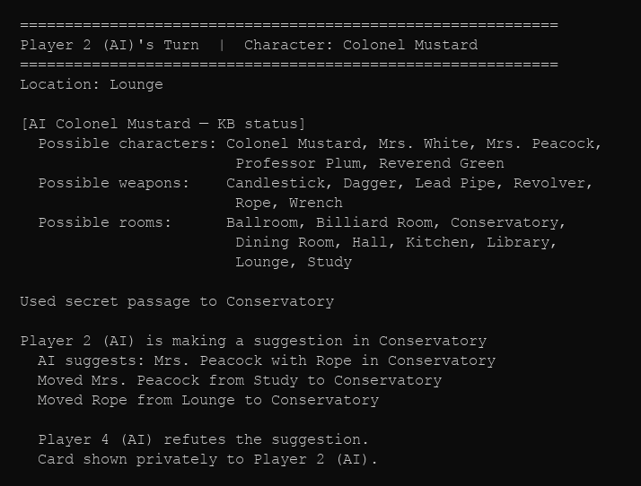
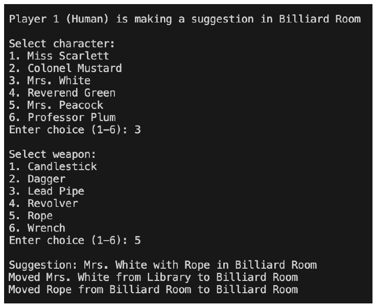
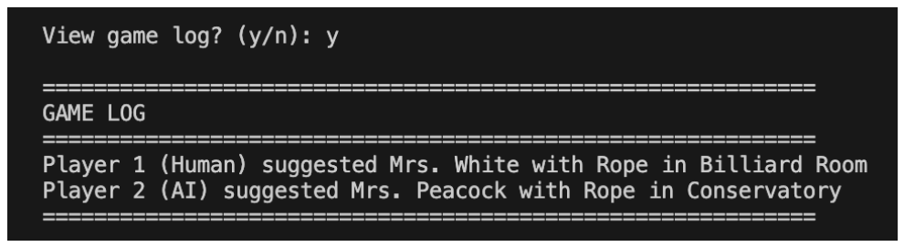
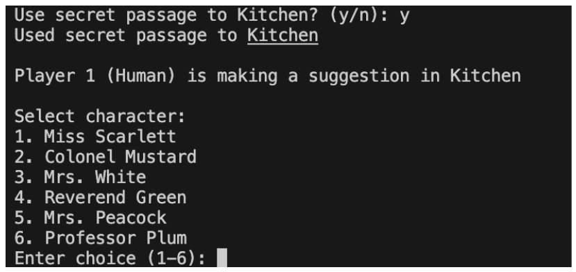
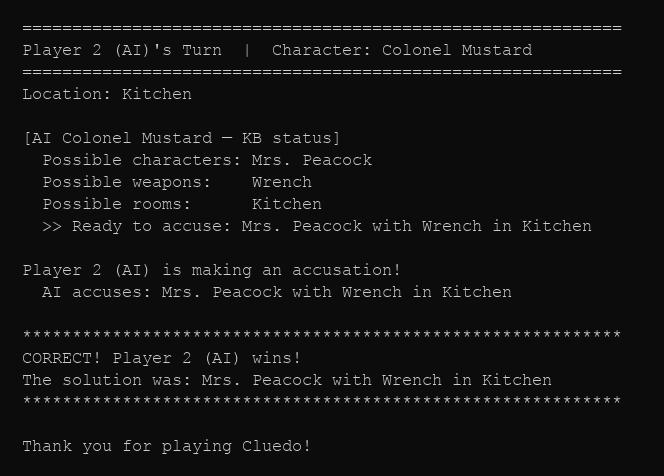

# Cluedo — AI Logical Deduction Agent

A Python implementation of the classic **Cluedo (Clue)** murder mystery board game with an AI player that uses **knowledge representation**, **logical inference**, and **strategic decision-making** to solve the mystery.

---

## Screenshots

**Game Setup** — 4 players (2 human, 2 AI), weapons randomly placed



**Mansion Layout + Game Start**



**Human Player Turn** — cards shown, game log, secret passage prompt



**AI Turn** — KB status printed, AI uses secret passage strategically, makes suggestion, gets refuted



**Human Suggestion** — character and weapon selection menu, refutation flow



**Game Log**



**Secret Passage Usage**



**AI Wins** — KB narrows to 1 possibility per category, AI accuses correctly



---

## One-liner

> Developed a complete text-based Cluedo board game with an intelligent AI player that uses a knowledge base, logical inference, and strategic movement to solve the murder mystery — supporting any combination of 3–6 human and AI players.

---

## Project Structure

```
├── cluedo_game.py              # Complete game: mechanics + AI logical deduction agent
├── tests/
│   └── test_knowledge_base.py  # 15 pytest unit tests for KnowledgeBase AI logic
├── requirements.txt
└── README.md
```

---

## Architecture

```
Game Initialization
        │
        ▼
┌──────────────────────────────────────────────────────┐
│                  Mansion (3×3 Grid)                   │
│  Study(0,0)    Hall(0,1)    Lounge(0,2)              │
│  Library(1,0)  Billiard(1,1)  Dining(1,2)            │
│  Conservatory(2,0)  Ballroom(2,1)  Kitchen(2,2)      │
│                                                      │
│  Secret passages: Study ↔ Kitchen, Cons ↔ Lounge     │
└──────────────────────────────────────────────────────┘
        │
        ▼
Solution sealed (1 character + 1 weapon + 1 room)
        │
        ▼
Card distribution (remaining 18 cards dealt to 3–6 players)
        │
        ▼
┌──────────────────────────────────────────────────────┐
│                Turn loop (3–6 players)                │
│                                                      │
│  ┌───────────┐   ┌───────────┐   ┌───────────┐       │
│  │  Human    │   │  AI Agent │   │  AI Agent │       │
│  └───────────┘   └───────────┘   └───────────┘       │
│                        │                             │
│               ┌────────▼────────┐                    │
│               │  KnowledgeBase  │                    │
│               │  own_cards      │                    │
│               │  possible_soln  │                    │
│               │  player_has     │                    │
│               │  player_not_has │                    │
│               └─────────────────┘                    │
└──────────────────────────────────────────────────────┘
        │
        ▼
Game end (correct accusation wins; wrong accusation eliminates)
```

---

## Features

### Core Game Mechanics

| Component | Details |
|-----------|---------|
| Rooms | 9 rooms on a 3×3 grid |
| Characters | Miss Scarlett, Colonel Mustard, Mrs. White, Reverend Green, Mrs. Peacock, Professor Plum |
| Weapons | Candlestick, Dagger, Lead Pipe, Revolver, Rope, Wrench |
| Secret passages | Study ↔ Kitchen, Conservatory ↔ Lounge |
| Players | 3–6 (any mix of human and AI) |
| Solution | 1 character + 1 weapon + 1 room, sealed at game start |
| Cards | 18 remaining cards distributed to players |

### AI `KnowledgeBase` Class

```python
class KnowledgeBase:
    own_cards: set          # Cards the AI holds
    possible_solution: dict # Remaining candidates per category
    player_has: dict        # Cards confirmed held by specific players
    player_not_has: dict    # Cards confirmed NOT held by specific players
    shown_cards: set        # All cards revealed so far
```

### AI Inference Methods

| Method | Purpose |
|--------|---------|
| `mark_own_card(card)` | Adds to `own_cards`; eliminates from `possible_solution` |
| `eliminate_from_solution(card)` | Removes card from the correct category set |
| `record_refutation(player, card)` | Records a specific shown card; eliminates from solution |
| `record_no_refutation(player, suggestion)` | Marks all 3 suggested cards as not held by that player |
| `record_someone_refuted(player, suggestion)` | Deduces the shown card when only one candidate remains |
| `get_solution_guess()` | Returns solution only when exactly 1 possibility per category |

---

## Key Design Decision — Deduction Under Uncertainty

The hard part of the AI is not tracking known cards, but **inferring unknown ones**.

When Player B refutes a suggestion but the AI can't see which card was shown, `record_someone_refuted` checks whether two of the three suggested cards are already ruled out (either in the AI's own hand or confirmed as not held by that player). If only one remains possible, that must be what was shown — and it's eliminated from the solution.

**Example:**
- AI owns `Colonel Mustard` and `Rope`
- Player 2 refutes suggestion `(Colonel Mustard, Rope, Kitchen)`
- Since the AI holds two of the three, Player 2 **must** have `Kitchen`
- `Kitchen` is deduced and removed from `possible_solution['rooms']`

A second design decision: when nobody refutes a suggestion, those cards are **not** eliminated from the solution — they simply aren't in any other player's hand. The AI instead records `player_not_has` for every player who was asked and passed, enabling downstream deduction as more evidence accumulates.

---

## AI Decision Flow

```
Start of AI turn
        │
        ▼
   Can accuse with 100% certainty?
   (1 possibility in each category)
        │
   Yes ─┤─ No
        │         │
   Accuse     Secret passage available AND destination still unknown?
                  │
             Yes ─┤─ No
                  │         │
             Use passage   Roll die → move toward unknown room
                  │         │
             Enter room → Enter room → make suggestion
             make suggestion using unknown chars/weapons
```

---

## Requirements

- Python 3.6+
- No external dependencies for gameplay (standard library only)
- `pytest>=7.0` for running tests

## Installation

```bash
git clone https://github.com/prabhathv07/Cluedo-AI-Logical-Deduction-Agent.git
cd Cluedo-AI-Logical-Deduction-Agent
```

## How to Run

```bash
# Play the game:
python cluedo_game.py

# Run tests:
pytest tests/ -v
```

## Game Setup

1. Enter number of players (3–6)
2. Select how many should be AI and which positions
3. Cards are distributed; the murder solution is sealed
4. Game begins with Player 1

## Movement Commands

| Command | Action |
|---------|--------|
| `UP <n>` | Move up n spaces |
| `DOWN <n>` | Move down n spaces |
| `LEFT <n>` | Move left n spaces |
| `RIGHT <n>` | Move right n spaces |
| `STOP` | End movement early |

Entering a room triggers an automatic suggestion. Other players refute clockwise by showing one matching card privately.

---

## Board Layout

```
Study (0,0)          Hall (0,1)          Lounge (0,2)
Library (1,0)        Billiard Room (1,1) Dining Room (1,2)
Conservatory (2,0)   Ballroom (2,1)      Kitchen (2,2)

Secret passages:  Study ↔ Kitchen  |  Conservatory ↔ Lounge
```

---

## Description

Cluedo AI is a fully playable, text-based implementation of the classic Cluedo (Clue) board game built in Python.

The `KnowledgeBase` class is the core AI component. Each AI player maintains a KB that tracks: every card in its own hand, every card shown during refutations, and every player who couldn't refute a suggestion. It applies process-of-elimination inference — when all but one candidate for a card are ruled out, the AI deduces the remaining card without being told. The AI uses secret passages strategically (only when the destination room is still uncertain), and only makes an accusation when all three solution categories are pinned to exactly one possibility. This mimics how a human detective reasons under uncertainty.

The project demonstrates knowledge-based AI, OOP design, and logical inference implemented entirely without external libraries.

---

## Tools & Technologies

| Category | Tool / Technology |
|----------|-------------------|
| **Language** | Python 3.6+ |
| **Paradigm** | Object-Oriented Programming (OOP) |
| **AI technique** | Knowledge-Based Reasoning, Logical Inference, Process of Elimination |
| **Standard library** | `random` — dice rolls, card shuffling, weapon placement |
| **Testing** | `pytest` — 15 unit tests for `KnowledgeBase` logic |
| **Version control** | Git, GitHub |
| **No external dependencies** | Runs on any Python 3.6+ installation |

---

## What I'd Do Next

- **GUI** — Visual board using Pygame or Tkinter with clickable rooms and card display
- **Stronger AI** — Bayesian inference or constraint propagation for deeper uncertainty
- **Difficulty levels** — Easy (random), Medium (own cards only), Hard (full KB)
- **Network multiplayer** — Socket support for online play
- **Save / load** — Serialize game state to JSON

---

## License

[MIT License](LICENSE) — Cluedo/Clue game concept by Hasbro.
